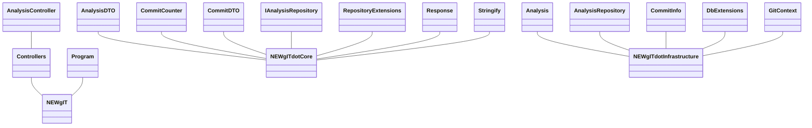

```mermaid
classDiagram-v2
    class NEWgIT
        class Controllers
            class AnalysisController
        class Program

        Controllers -- NEWgIT
            AnalysisController -- Controllers
        Program -- NEWgIT

    class NEWgITdotCore
        class AnalysisDTO
        class CommitCounter
        class CommitDTO
        class IAnalysisRepository
        class RepositoryExtensions
        class Response
        class Stringify

        AnalysisDTO -- NEWgITdotCore
        CommitCounter -- NEWgITdotCore
        CommitDTO -- NEWgITdotCore
        IAnalysisRepository -- NEWgITdotCore
        RepositoryExtensions -- NEWgITdotCore
        Response -- NEWgITdotCore
        Stringify -- NEWgITdotCore

    class NEWgITdotInfrastructure
        class Analysis
        class AnalysisRepository
        class CommitInfo
        class DbExtensions
        class GitContext

        Analysis -- NEWgITdotInfrastructure
        AnalysisRepository -- NEWgITdotInfrastructure
        CommitInfo -- NEWgITdotInfrastructure
        DbExtensions -- NEWgITdotInfrastructure
        GitContext -- NEWgITdotInfrastructure
```
