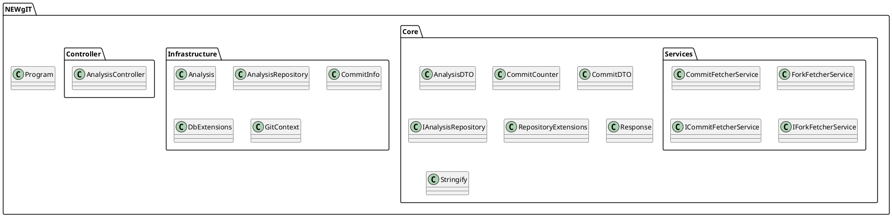

```plantuml
@startuml classDiagram

namespace NEWgIT.Core {
  namespace Services{
    class CommitFetcherService{}
    class ForkFetcherService{}
    class ICommitFetcherService{}
    class IForkFetcherService{}
  }
  class AnalysisDTO {}
  class CommitCounter{}
  class CommitDTO{}
  class IAnalysisRepository{}
  class RepositoryExtensions{}
  class Response{}
  class Stringify{}
}

namespace NEWgIT.Infrastructure{
  class Analysis{}
  class AnalysisRepository{}
  class CommitInfo{}
  class DbExtensions{}
  class GitContext{}
}

namespace NEWgIT{
  namespace Controller{
    class AnalysisController{}
  }
  class Program{}
}

@enduml
```
