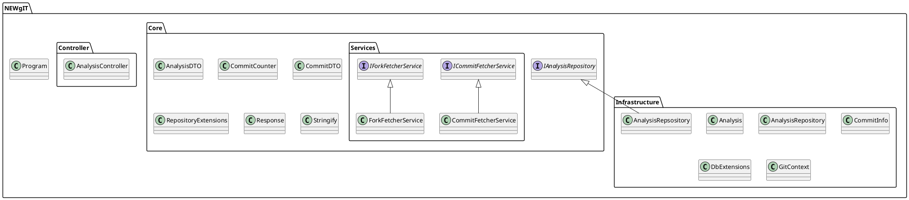
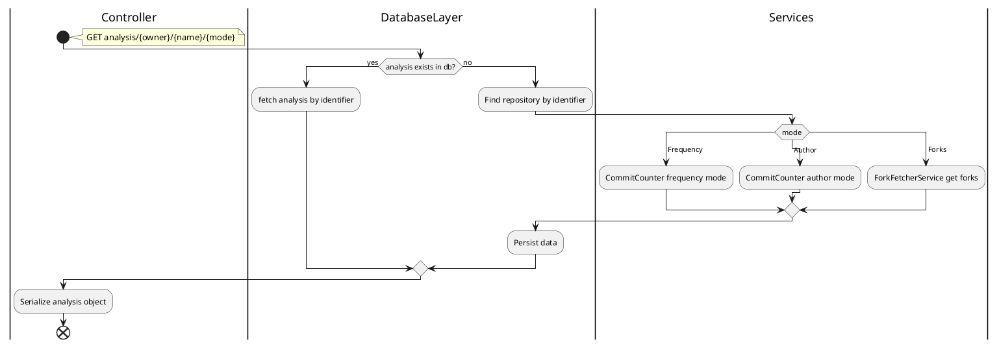

# UML Diagrams code

This documents holds the code for the different UML diagrams.
The reason for making this documents is that PlantUML is not visualy supported by markdown.
Therefore another (TODO link to location) document will hold the png's.

## Package Diagram

## Activity Diagram

