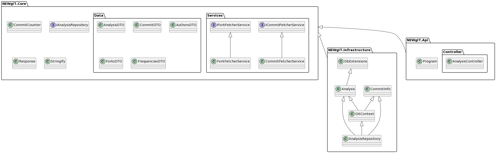
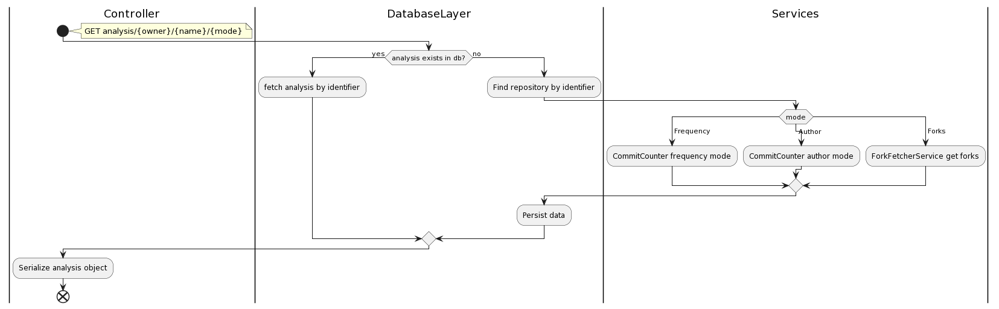
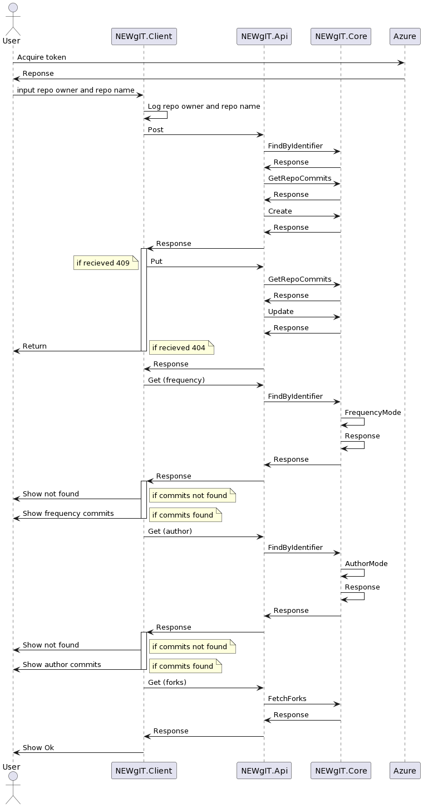

# Diagrams

This document holds the UML diagrams for the project.

## Package Diagram

This is the package diagram for the project. It shows the different packages and their dependencies.

The reason that `NEWgIT` is not shown to depend on `AnalysisRepository` or `NEWgIT.Infrastructure` is because it depends on `IAnalysisRepository`. Later in the runtime `IAnalysisRepository` will be implemented by the concrete class.

## Activity Diagram

This is the activity diagram for API. It shows the different activities that are performed when the user requests an analysis.

## Sequence Diagram

This is the sequence diagram seen from when a user starts interacting with `NEWgIT`.

