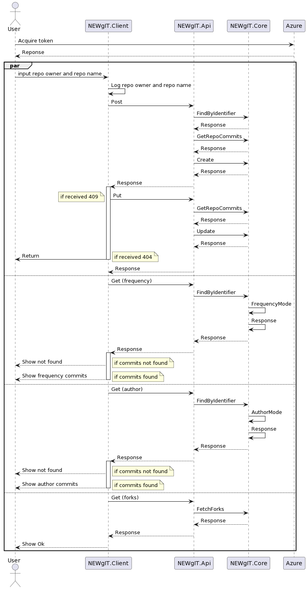

# Presentation for week 49

## Application Correctness

Functional:

1. GIT analyzations has to be stored in a database.

Manually:

1. Implement visualizations to your .Net Blazor front-ends that look similar to those in the illustrations on top of the docs.
2. Implement a visualization of the forks of a GitHub repository as a third visualization.

Did not complete:

1. Implement an analysis and visualization of your choice in your GitInsight application

Non functional:

AnalysisRepositoryTests:

1. Build a small C#/.Net Core application that can be run from the command-line.
2. Given that path to a repository, your application should collect all commits with respective author names and author dates. 
3. The analyzations has to know which repo they are from:
    If repo is re-analyzed and analyzations are outdated it has to update the database (line 234)
    If repo is re-analyzed and analyzations are up to date it has to read analyzations from the database (line 206)
4. The analysis that your GitInsight application is performing (on that now cloned local repository) should remain the same

AnalysisControllerTest:

1. When running GitInsight in commit frequency mode, it should produce textual output on stdout that lists the number of commits per day.
2. When running GitInsight in commit author mode, it should produce textual output on stdout that lists the number of commits per day per author.
3. In case the repository was already cloned earlier, then the respective local repository shall be updated
4. The REST API shall return the analysis results via a JSON object

Manually:

1. Extend your GitInsight application with a feature that restricts access only to authorized users. Users have to authenticate themselves before they are able to analyze a GitHub repository.

## Design Patterns

Singleton yay

## Architectural Patterns

Our implementation is based on the clean architecture discussed in the lectures. The blazor page is handling both the presentation and the UI. when user input has been handled, it is passed to the controller which sends it to our analysis repository which handles business logic.

This business logic is done on already stored analysis entities which are accessed with database contexts

### Authentication & Authorization

We have implemented authentication to secure our application. By using authentication we ensure that only users who have created an account are able to use our frontend. To ensure the quality of our authentication layer, we decided to use Microsoft Azure AD. Specifically, we use the Business-to-Consumer feature to allow for the use of different identity providers. As of right now, users can sign up using email or using their Microsoft account. We would have liked to provide GitHub SSO, to also enable authorization for private repositories but used our time elsewhere.

This works by hooking into the Azure authentication flow, which on successful login provides an identity token for the application.

To protect against malicious front-end users, this is also enforced in the backend. Apart from getting an ID token from Azure, the frontend is also provided with an access token, used to authorize the API requests to our backend using the "Bearer token" format.

## Design Principles

Single responsebility

1. The `AnalysisController` class is responsible for handeling HTTP requests related to code analysis, and the `ICommitFetcherService` and `IForkFetcherService` interfaces define a clear set of methods for fetching commits and forks, respectively.  

Dependency inversion
1. The `AnalysisController` class follows this principle because it uses construtor injection to inject dependencies into the ?`AnalysisController` class. This allows the class to depend on abstactions in this case interfaces, rather than on concrete implementations of those abstractions. By using this, our code becomes more flexible and eaiser to maintain because the dependencies of the `AnalysisController` class can be changed without modifying the class itself.  

## Testing and Code Quality

At the start the tests lacked a bit behind the development.
When the tests were written to get 100% coverage SonarCloud was also implemented.
SonarCloud also makes sure that the code quality is good, and we do not have any codesmells.
This can be seen here: 

Even though we have 100% coverage, we have not implemented any integreation tests.
This is a shortcoming of our project, and we would have liked to implement this.

The non-functional requirements are also met which can be seen below:

1. Build a small C#/.Net Core application that can be run from the command-line. As a parameter, it should receive the path to a Git repository that resides in a local directory, i.e., a directory on your computer.
    * Solved in `AnalysisRepositoryTests.cs`. The test runs on a repository created on runtime.
2. Given that path to a repository, your application should collect all commits with respective author names and author dates. The data can be collected with the library libgit2sharp, which can be installed from NuGet.
    * Solved in `AnalysisControllerTests.cs`.
3. Your program should be able to run in two modes, which may be indicated via command-line switches.
    1. When running GitInsight in commit frequency mode, it should produce textual output on stdout that lists the number of commits per day. For example, the output might look like the following:
        

        
Example

                1 2017-12-08
                6 2017-12-26
                12 2018-01-01
                13 2018-01-02
                10 2018-01-14
                7 2018-01-17
                5 2018-01-18 
        

    2. When running GitInsight in commit author mode, it should produce textual output on stdout that lists the number of commits per day per author. For example, the output might look like the following:
        

        
Example

            Marie Beaumin
                1 2017-12-08
                6 2017-12-26
                12 2018-01-01
                13 2018-01-02
                10 2018-01-14
                7 2018-01-17
                5 2018-01-18 

            Maxime Kauta
                5 2017-12-06
                3 2017-12-07
                1 2018-01-01
                10 2018-01-02
                21 2018-01-03
                1 2018-01-04
                5 2018-01-05 
        

    *  Solved in `AnalysisControllerTests.cs`.

4. The analyzations has to know which repo they are from.
    1. If repo is re-analyzed and analyzations are outdated it has to update the database.
    2. If repo is re-analyzed and analyzations are up to date it has to read analyzations from the database.
    * Solved in `AnalysisRepositoryTests.cs`.

5. The REST API shall receive a repository identifier from GitHub. The form could be:
    1. <github_user>/<repository_name> 
    2. <github_organization>/<repository_name>
    * Solved in `AnalysisControllerTests.cs`.
6. If the repository does not exist locally, then your GitInsight application shall clone the remote repository from GitHub and store it in a temporary local directory on your computer.
    * Solved in `AnalysisControllerTests.cs`.
7. In case the repository was already cloned earlier, then the respective local repository shall be updated. That is, using libgit2sharp your application should update the local repository similar to running a git pull if you were to update a Git repository manually.
    * Solved in `AnalysisControllerTests.cs`.
8. The analysis that your GitInsight application is performing (on that now cloned local repository) should remain the same.
    * Solved in `AnalysisRepositoryTests.cs`.
9. The REST API shall return the analysis results via a JSON object.
    * Solved in `AnalysisControllerTests.cs`.
10. To connect to the GitHub REST API, you need an Access Token. Read [this documentation](https://docs.github.com/en/authentication/keeping-your-account-and-data-secure/creating-a-personal-access-token) on how to receive an Access Token for the GitHub REST API. Remember and double check on how Rasmus demonstrated to handle secrets like access tokens in .Net projects. That is, do not store the access token directly in your source code. It should never end up in your source code repository that is publicly shared with the world.
    * Not solved completly but is manualy tested.
11. Extend your `GitInsight` application with a feature that restricts access only to authorized users. Users have to authenticate themselves before they are able to analyze a GitHub repository.
    * Not solved completly but is manualy tested.
12. Complete test suite.
    * Can be seen here: 

## UML

### Package Diagram

This is the package diagram for the project. It shows the different packages and their dependencies.

The reason that `NEWgIT` is not shown to depend on `AnalysisRepository` or `NEWgIT.Infrastructure` is because it depends on `IAnalysisRepository`. Later in the runtime `IAnalysisRepository` will be implemented by the concrete class.

### Activity Diagram

This is the activity diagram for API. 
It shows the different activities that are performed when the user requests an analysis.

### Sequence Diagram

This is the sequence diagram seen from when a user starts interacting with `NEWgIT`.

`NEWgIT.Infrastructure` is not shown because `NEWgIT` only "knows" about the `IAnalysisRepository` and not about its implementation.
